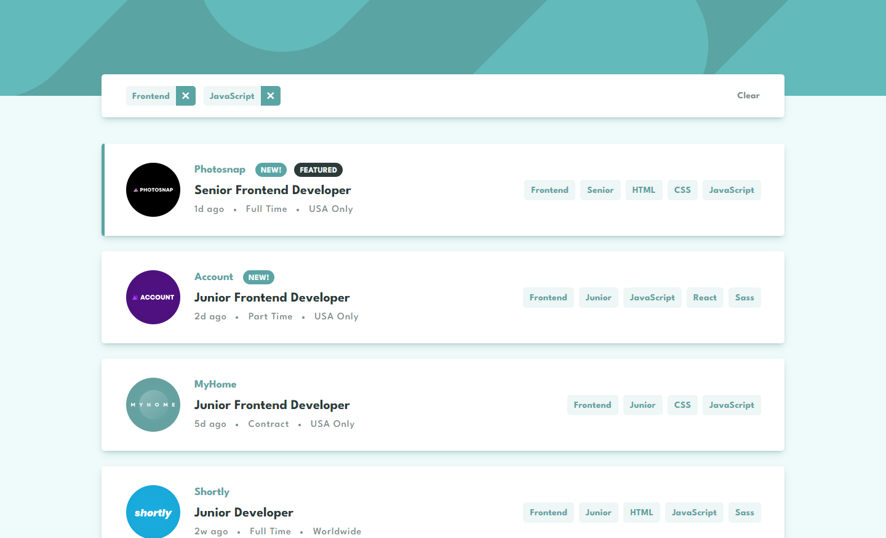

# Проект - Job listings

[README in English](./README-en.md)

Проект представляет из себя однострочное приложение, которое позволяет пользователю найти работу в различных компаниях. Выполнен в рамках задания с сайта [Frontend Mentor](https://www.frontendmentor.io).

## Оглавление

- [Обзор проекта](#обзор-проекта)
  - [Задачи проекта](#задачи-проекта)
  - [Функциональность проекта](#функциональность-проекта)
  - [Screenshot](#screenshot)
  - [Директории проекта](#директории-проекта)
  - [Запуск проекта](#запуск-проекта)
  - [Ссылки](#ссылки)
- [Ход выполнения проекта](#ход-выполнения-проекта)
  - [Используемые технологии](#используемые-технологии)
  - [Чему я научился работая над проектом](#чему-я-научился-работая-над-проектом)
- [Автор](#автор)

## Обзор проекта

### Задачи проекта

Предоставлять пользователю информацию о вакансиях в различных компаниях.

### Функциональность проекта

- Вывод вакансий
- Фильтрация вакансий с помощью тегов

### Screenshot

### Директории проекта

- `src/assets` — директория со статичными файлами
- `src/components` — директория с компонентами
- `src/store` — директория с файлами state-менеджера
- `src/styles` — директория с глобальными стилями, переменными и миксинами
- `src/UI` — директория с компонентами UI-kit
- `src/utils` — директория со вспомогательными утилитами

### Запуск проекта

- `npm start` - режим разработки с запуском локального сервера
- `npm run build` - режим сборки проекта в продакшн
- `npm run test` - запуск в режиме тестирования
- `npm run eject` - режим извлечения конфигов CRA
- `npm run lint` - запускает линтер
- `npm run lint:fix` - запускает линтер, в режиме устранения мелких замечаний
- `npm run format` - запуск форматера кода
- `npm run prepare` - подготавливает Husky к работе, запускается единожды при старте проекта
- `npm run commit` - запускает commitizen для коммита
- `npm run storybook` - запускает Storybook в режиме разработки
- `npm run build-storybook` - запускает Storybook в режиме продакшн

### Ссылки

- [Ссылка на репозиторий проекта](https://github.com/Bjorn86/fm-job-listings)
- [Ссылка на демо-страницу проекта](https://bjorn86.github.io/fm-job-listings/)

## Ход выполнения проекта

### Используемые технологии

- HTML
- SCSS
- JS
- [React](https://react.dev/)
- [Redux](https://redux.js.org/)
- [React Redux](https://react-redux.js.org/)
- [Reselect](https://www.npmjs.com/package/reselect)
- [Storybook](https://storybook.js.org/)
- [Husky](https://typicode.github.io/husky/)
- [Commitizen](https://commitizen-tools.github.io/commitizen/)
- Адаптивная вёрстка
- Семантическая вёрстка

### Чему я научился работая над проектом

- Работе со state-менеджером Redux
- Работе с Storybook
- Закрепил знания о технологиях HTML, SCSS, JS, React

## Автор

**Данила Легкобытов**

- e-mail: [legkobytov-danila@yandex.ru](mailto:legkobytov-danila@yandex.ru)
- LinkedIn: [in/danila-legkobytov](https://www.linkedin.com/in/danila-legkobytov/)
- Telegram: [@danila_legkobytov](https://t.me/danila_legkobytov)
- Frontend Mentor: [@danila_legkobytov](https://www.frontendmentor.io/profile/Bjorn86)
